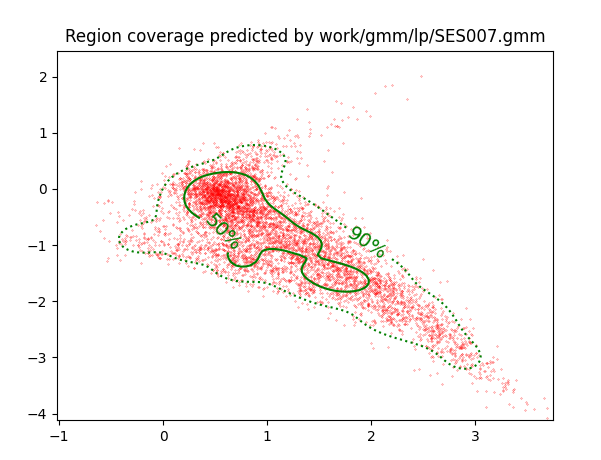
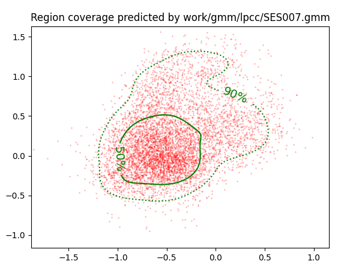
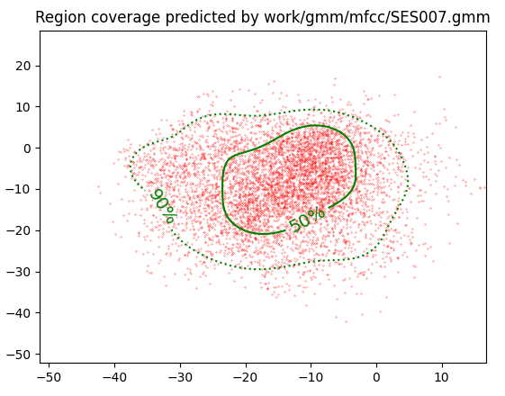
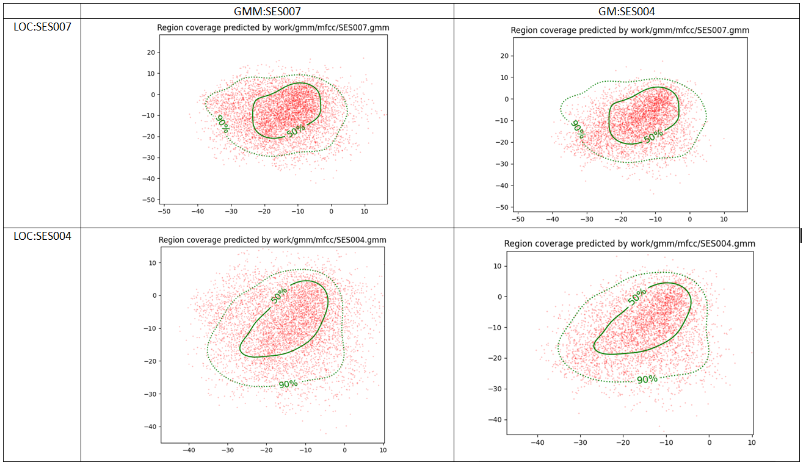

PAV - P4: reconocimiento y verificación del locutor
===================================================

Obtenga su copia del repositorio de la práctica accediendo a [Práctica 4](https://github.com/albino-pav/P4)
y pulsando sobre el botón `Fork` situado en la esquina superior derecha. A continuación, siga las
instrucciones de la [Práctica 2](https://github.com/albino-pav/P2) para crear una rama con el apellido de
los integrantes del grupo de prácticas, dar de alta al resto de integrantes como colaboradores del proyecto
y crear la copias locales del repositorio.

También debe descomprimir, en el directorio `PAV/P4`, el fichero [db_8mu.tgz](https://atenea.upc.edu/mod/resource/view.php?id=3654387?forcedownload=1)
con la base de datos oral que se utilizará en la parte experimental de la práctica.

Como entrega deberá realizar un *pull request* con el contenido de su copia del repositorio. Recuerde
que los ficheros entregados deberán estar en condiciones de ser ejecutados con sólo ejecutar:

~~~~~~~~~~~~~~~~~~~~~~~~~~~~~~~~~~~~~~~~~~~~~~~~~~~~~.sh
  make release
  run_spkid mfcc train test classerr verify verifyerr
~~~~~~~~~~~~~~~~~~~~~~~~~~~~~~~~~~~~~~~~~~~~~~~~~~~~~

Recuerde que, además de los trabajos indicados en esta parte básica, también deberá realizar un proyecto
de ampliación, del cual deberá subir una memoria explicativa a Atenea y los ficheros correspondientes al
repositorio de la práctica.

A modo de memoria de la parte básica, complete, en este mismo documento y usando el formato *markdown*, los
ejercicios indicados.

## Ejercicios.

### SPTK, Sox y los scripts de extracción de características.

- Analice el script `wav2lp.sh` y explique la misión de los distintos comandos involucrados en el *pipeline*
  principal (`sox`, `$X2X`, `$FRAME`, `$WINDOW` y `$LPC`). Explique el significado de cada una de las 
  opciones empleadas y de sus valores.

  El comando 'sox' realiza múltipes tareas con ficheros de audio. Por ejemplo, cambiar el formato o realizar operaciones de procesado de señal como transformadas o reducción de ruido.

  El comando '$X2X' permite la conversión entre distintos formatos de datos.

  Con el comando '$FRAME' extraemos frame a frame toda una secuencia.

  El comando '$WINDOW' (como su nombre indica) se utiliza para enventanar los datos.

  Por último, el comando '$LPC' sirve para calcular los coeficientes LPC usando el método Levinsos-Durbin. 

- Explique el procedimiento seguido para obtener un fichero de formato *fmatrix* a partir de los ficheros de
  salida de SPTK (líneas 45 a 51 del script `wav2lp.sh`).

Utilizando fmatrix, generamos una matriz con nrow filas, que representan las tramas de la señal, y ncol columnas, que representan los coeficientes de cada trama. La cantidad de columnas corresponde al número de coeficientes del predictor lineal más uno. La cantidad de filas se determina primero convirtiendo la señal en texto y luego contando las filas con el comando wc -l.

  * ¿Por qué es más conveniente el formato *fmatrix* que el SPTK?
  Porque con el formato *fmatrix* podemos identificar más fácilmente cada trama por las filas y sus coeficientes por las columnas.

- Escriba el *pipeline* principal usado para calcular los coeficientes cepstrales de predicción lineal
  (LPCC) en su fichero <code>scripts/wav2lpcc.sh</code>:

# Main command for feature extration
sox $inputfile -t raw -e signed -b 16 - | $X2X +sf | $FRAME -l 240 -p 80 |
    $WINDOW -l 240 -L 240 | $LPC -l 240 -m $lpc_order | $LPCC -m $lpc_order -M $lpcc_order > $base.lpcc || exit 1
  

- Escriba el *pipeline* principal usado para calcular los coeficientes cepstrales en escala Mel (MFCC) en su
  fichero <code>scripts/wav2mfcc.sh</code>:
  
# Main command for feature extration
sox $inputfile -t raw -e signed -b 16 - | $X2X +sf | $FRAME -l 240 -p 80 | $WINDOW -l 240 -L 240 |
	$MFCC -m $mfcc_order -n $melfilter_bank_order > $base.lp || exit 1
   

### Extracción de características.

- Inserte una imagen mostrando la dependencia entre los coeficientes 2 y 3 de las tres parametrizaciones
  para todas las señales de un locutor.
  
  + Indique **todas** las órdenes necesarias para obtener las gráficas a partir de las señales 
    parametrizadas.

LP --> plot_gmm_feat -x 2 -y 3 -g green work/gmm/lp/SES007.gmm work/lp/BLOCK00/SES007/*

LPP --> plot_gmm_feat -x 2 -y 3 -g green work/gmm/lpp/SES007.gmm work/lpp/BLOCK00/SES007/*

MFCC --> plot_gmm_feat -x 2 -y 3 -g green work/gmm/mfcc/SES007.gmm work/mfcc/BLOCK00/SES007/*

  REVISAR

  + ¿Cuál de ellas le parece que contiene más información?
  Las gráficas con menor correlación, es decir, aquellas cuyos puntos están más dispersos, son las que proporcionan mayor información. Por lo tanto, los métodos de mfcc y lpcc son los que aportan más información.

- Usando el programa <code>pearson</code>, obtenga los coeficientes de correlación normalizada entre los
  parámetros 2 y 3 para un locutor, y rellene la tabla siguiente con los valores obtenidos.

  |                        | LP   | LPCC | MFCC |
  |------------------------|:----:|:----:|:----:|
  | &rho;x[2,3] |-0.76 | 0.28 | 0.54 |
  
  + Compare los resultados de <code>pearson</code> con los obtenidos gráficamente.
  Como hemos dicho anteriormente, las gráficas con menor correlación corresponden a los métodos cuya rho es menor en valor absoluto. Vemos que LPCC y MFCC tienen un coeficiente menor que el de LP. Esto se ve reflejado en las gráficas puesto que LP es el método con más correlación.

  Nos ha sorprendido el valor de la &rho ya que en teoria la correlación usando mfcc debería ser menor a la de LPCC. Esto nos ha llevado a pensar que quizás hay un error de código o no hemos usado los comandos adecuados. 
  
- Según la teoría, ¿qué parámetros considera adecuados para el cálculo de los coeficientes LPCC y MFCC?

En el caso de LPCC; el número de coefs para la predicción lineal suele estar entre 8 y 16, la ventana de análisi entre 20 i 30 ms, un filtro de preenfais y el tamaño de la FFt debe ser una potencia de 2 así que usaríamos o 512 o 1024.

Y para el caso de MFCC; usariamos aprox. 12 coeficientes cepstrales, entre 20 y 40 filtros y para el resto de parámetros los mismos valores comentados anteriormente para LPCC. 

### Entrenamiento y visualización de los GMM.

Complete el código necesario para entrenar modelos GMM.

- Inserte una gráfica que muestre la función de densidad de probabilidad modelada por el GMM de un locutor
  para sus dos primeros coeficientes de MFCC.

 

- Inserte una gráfica que permita comparar los modelos y poblaciones de dos locutores distintos (la gŕafica
  de la página 20 del enunciado puede servirle de referencia del resultado deseado). Analice la capacidad
  del modelado GMM para diferenciar las señales de uno y otro.

  

Podemos observar que cuando el locutor y la población coinciden obtenemos mejores gráficas. Cuando no coinciden vemos más dispersión.

### Reconocimiento del locutor.

Complete el código necesario para realizar reconociminto del locutor y optimice sus parámetros.

- Inserte una tabla con la tasa de error obtenida en el reconocimiento de los locutores de la base de datos
  SPEECON usando su mejor sistema de reconocimiento para los parámetros LP, LPCC y MFCC.

  |                        | LP   | LPCC | MFCC |
  |------------------------|:----:|:----:|:----:|
  | Tasa de error (%)      | 12.3 | 0.51 | 1.4  |

### Verificación del locutor.

Complete el código necesario para realizar verificación del locutor y optimice sus parámetros.

- Inserte una tabla con el *score* obtenido con su mejor sistema de verificación del locutor en la tarea
  de verificación de SPEECON. La tabla debe incluir el umbral óptimo, el número de falsas alarmas y de
  pérdidas, y el score obtenido usando la parametrización que mejor resultado le hubiera dado en la tarea
  de reconocimiento.

  |                        | LP      | LPCC   | MFCC   |
  |------------------------|:-------:|:------:|:------:|
  |Umbral óptimo           | 0.557   | 1.469  | 0.432  |
  | Misses                 | 83/250  | 24/250 | 23/250 |
  | Falsa alarma           | 14/1000 | 6/1000 | 7/1000 |
  | Cost detection         | 44.8    | 15     | 15.5   |
 
### Test final

- Adjunte, en el repositorio de la práctica, los ficheros `class_test.log` y `verif_test.log` 
  correspondientes a la evaluación *ciega* final.

### Trabajo de ampliación.

- Recuerde enviar a Atenea un fichero en formato zip o tgz con la memoria (en formato PDF) con el trabajo 
  realizado como ampliación, así como los ficheros `class_ampl.log` y/o `verif_ampl.log`, obtenidos como 
  resultado del mismo.
